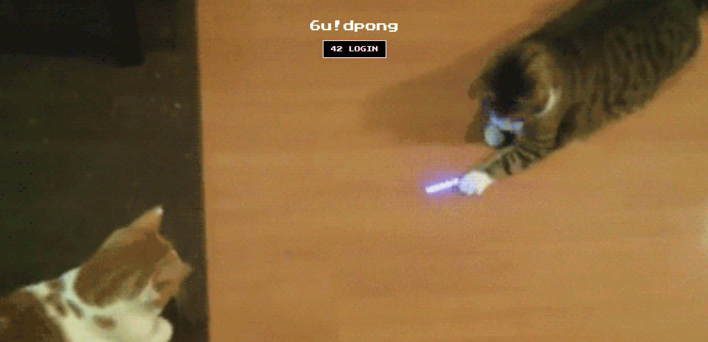

멀티 플레이어 pong & 채팅 웹 서비스


## About This Project

6u!dpong은 typescript 기반, React, Nestjs를 기반으로 만든 웹 채팅 / 핑퐁 게임 사이트이다.

페이지 구성은 OAuth 로그인 페이지, 메인 로비, 채팅방(DM, 단체방), 게임방, 마이페이지 등으로 구성되어있으며, 유저의 현재 상태(Game, Online 등), 전적 등을 확인할 수 있다.

## login



> - 최초 로그인 시, 42API를 통해 인증을 받는다(google OAuth와 동일한 방식)
> - 프로필 작성에서 사진, 닉네임, 2차인증을 활성화 가능하며, 따로 등록하지 않으면 기본 프로필을 42API에서 가져옴.

<br/>
<!-- 


<p align="center"><a href="2factor"></a></p> -->

<br/>

## 2차 인증

> - 2차 인증 활성화시 42 intra에 등록된 이메일 주소로 이메일을 전송해(nodemailer) 2차 인증 코드를 받아온다.
> - 매번 로그인시 2차 인증을 기입해야 하며, 마이페이지에서 활성화 해제가 가능하다.

<br/>

## Main Page


> - 메인 페이지에서 game, chat 위에 마우스 토글 시, 아래와 같이 바뀌며, 각각의 채팅방 내지 게임 로비로 이동한다.
> - 상단의 검색바에서 친구 추가 등의 검색이 가능한 상단 바 사용이 가능하다.

<br/>

## MyPage


> - 게임 전적, 프로필 변경, 친구 및 밴 리스트 등 확인이 가능하다.
> - ladder / custom 버튼을 눌러 각각 레더 및 custom 게임에 대한 전적을 볼 수 있다.
> - 친구리스트에 들어가면 친구 요청 및 친구 상태 확인이 가능하다(block list도 동일).


## chat

> DM, 단체채팅방으로 구성되어있다.

DM


> - 상단 검색바를 통해 DM을 보낼 수 있고, DM을 받은 상대방은 채팅방 안에서 채팅 확인이 가능하다.
>
> * 읽음 표시 및 채팅 개수 확인이 가능하다.

단체 채팅방


> - 단체 채팅방을 생성한다.
> - 비밀번호를 설정할 수 있으며, private으로 설정시 전체 채팅방 리스트에서 공개되지 않는다(초대로만 참여 가능)
> - 방을 만든 사람이 관리자가 되며, 관리자는 kick, mute, ban을 할 수 있고, 방장 변경, 관리자 권한 변경 등을 할 수 있다.
> - Setting에서 멤버 관리, 채널 삭제, 비밀번호 변경 등이 가능하다.

## game

> 초대, 래더, 공개방으로 구성되어있다.

일반 게임


> - 게임 룸을 생성해서 유저가 들어오면 게임 플레이가 가능하다.
> - 유저가 destroy 모드를 키면 벽을 통과해 반대편에서 공이 튀어나온다.
> - 비밀번호를 설정하여 비공개 방을 만들 수 있다.

래더 매칭


> - 랜덤 매칭으로 유저가 매칭되면 게임이 시작하고, 이기면 점수가 오르고, 지면 떨어지는 방식이다.

게임 초대


> - 상단 검색바에서 유저를 검색해 들어가서 1대1 매칭이 가능하다.
> - 초대를 받으면 우측 하단에 초대가 오며, 일반 게임 매칭 화면으로 가서 게임 플레이가 가능하다.

## how to use

1. 해당 프로젝트는 42 API를 사용해서 진행되는 프로젝트이므로, 42 cadet이어야 사용가능 하다.
2. 42 API를 통해 intra ID, UID, redirection URL 등을 통해 서비스에 접근한다.
3. docker container로 각각 postgre(database), front-end(react), web server(nginx), back-end(Nestjs)를 관리하고, Makefile을 통해 컨테이너를 실행시키기 때문에 Docker 및 makefile이 설치되있어야한다.

### Install

1. clone repository

```
git clone https://github.com/wjcheon96/6uidpong
```

2. run docker by makefile

```
make
```

- Makefile이 설치되어있지 않은 경우, 아래의 명령어로 도커를 직접 실행해서 사용이 가능하다.

```
docker-compose -f docker-compose.yml up --build
```

## 파트 분배

Front-end
송기종, 천웅재

Back-end
손영원, 천웅재

## 세부 기능 및 역할

Front-end

```
송기종

1. OAuth 인증 및 로그인 기능 구현, axios 및 context를 통한 소켓 관리
2. DM, 단체 채팅 페이지 구현
3. 마이페이지 구현

천웅재
1. 2차 인증, 최초 프로필 변경 및 전적 관리 페이지 구현
2. 래더, 게임 대기방, 게임 페이지 구현

```

Back-end

```
손영원
1. OAuth 인증 및 로그인 기능 구현.
2. DM, 단체 채팅 구현
3. 마이페이지 구현

천웅재
1. 2차 인증 및 최초 프로필 변경, 전적관리 구현
2. 래더 큐, 게임 대기, 게임 구현
```

## wire frame

[Figma](https://www.figma.com/file/5mikOmeyQjtW5OugaY2lEd/6u!dpong?type=design&t=jYA9AOq73qOPwjdc-6)
